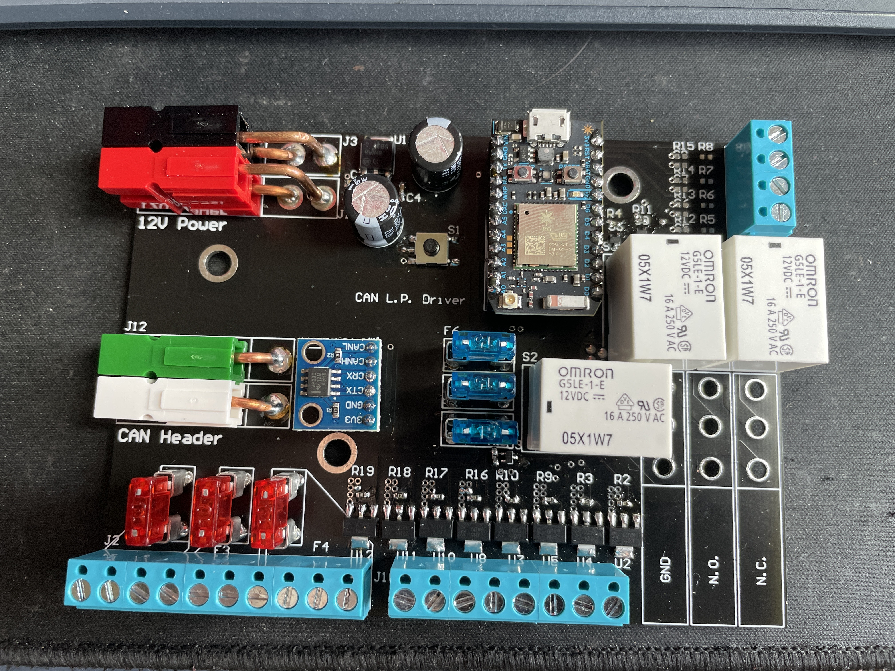
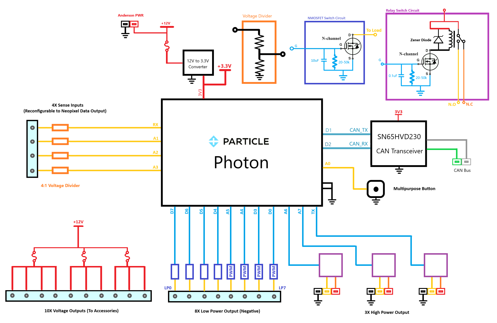
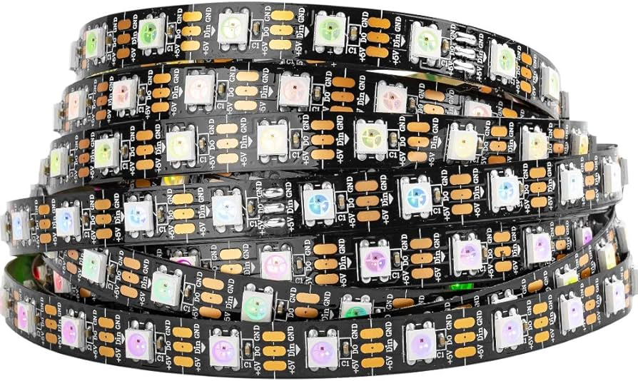
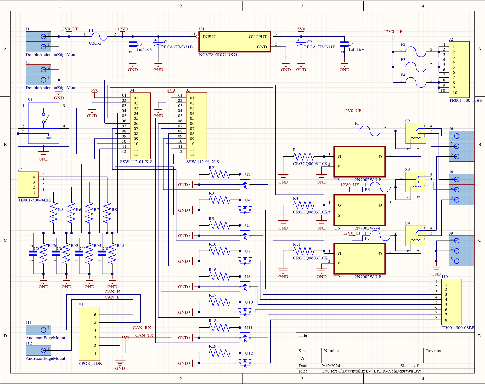
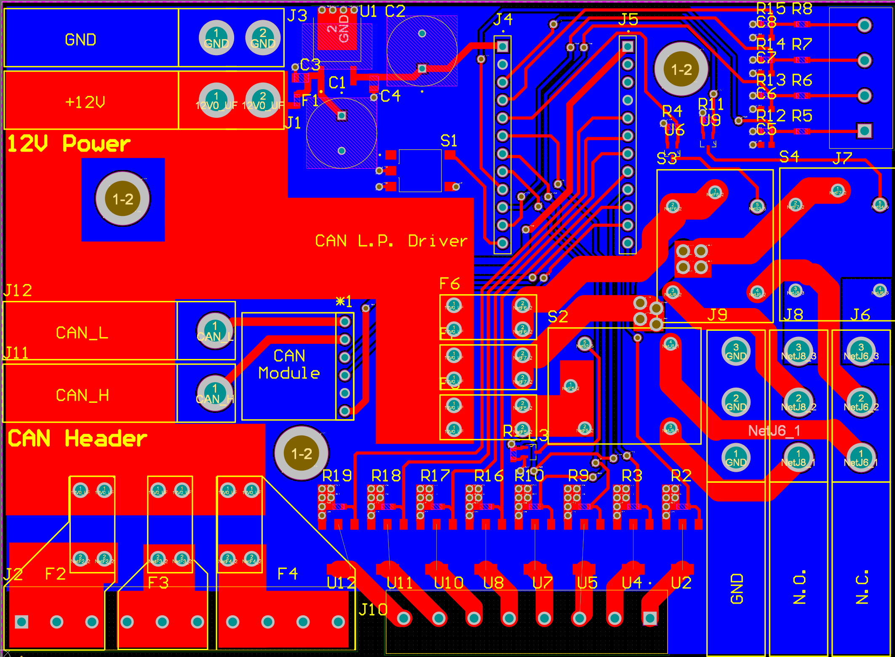

# DecentralizedLV-LPDRV
Software Repository for Low Power Driver Board

## Project Overview

The DecentralizedLV Low-Power Driver Board (LPDRV) has the primary role of powering the accessories in the vehicle. One LPDRV board is placed on each corner of the vehicle and is connected to accessory components such as lights, cooling fans, and cooling pumps. It determines if those are accessories should be powered based on CAN Bus messages it receives from the [DecentralizedLV Dash Controller](https://github.com/matthewpanizza/DecentralizedLV-DashController) and [DecentralizedLV Power Controller](). See the main [DecentralizedLV-Documentation](https://github.com/matthewpanizza/DecentralizedLV-Documentation) repository for information about the DecentralizedLV system and how to set up the software environment for programming this board.

## Block Diagram

## Hardware Capabilities
- 4X PWM-Capable [Low-power driver pins](https://github.com/matthewpanizza/DecentralizedLV-Documentation?tab=readme-ov-file#low-power-output-pins-supply-power-to-low-power-devices-less-than-5-amps) (A5, A4, D3, D0) (N-MOSFET Configuration)
- 4X Non-PWM [Low-power driver pins](https://github.com/matthewpanizza/DecentralizedLV-Documentation?tab=readme-ov-file#low-power-output-pins-supply-power-to-low-power-devices-less-than-5-amps) (D7, D6, D5, D4) (N-MOSFET Configuration)
- 3X fused [High-power driver pins](https://github.com/matthewpanizza/DecentralizedLV-Documentation?tab=readme-ov-file#high-power-output-pins-supply-power-to-high-power-devices-greater-than-5-amps) (A6, A7, RX) with Normally-Open and Normally-Closed output connectors.
- 4X [Sense Pins](#https://github.com/matthewpanizza/DecentralizedLV-Documentation?tab=readme-ov-file#sense-pins-read-binary-onoff-switches-or-12v-signals) (4:1 voltage divider ratio)
- [Neopixel](https://github.com/matthewpanizza/DecentralizedLV-Documentation?tab=readme-ov-file#addressable-led-strips-neopixel) Data Output
- 10X fused 12V passthrough header to connect positive terminal of low-power accessories
- Multipurpose push-button

## Important Roles
- Responsible for distributing power received from the Power Controller to the majority of accessory components (lights, pumps, fans) in the low-voltage electrical system
- Has the capability to read in 12V signals using [Sense Pins](#https://github.com/matthewpanizza/DecentralizedLV-Documentation?tab=readme-ov-file#sense-pins-read-binary-onoff-switches-or-12v-signals) and passing that information to other places in the vehicle
- Controls [Neopixel LED Strips](https://github.com/matthewpanizza/DecentralizedLV-Documentation?tab=readme-ov-file#addressable-led-strips-neopixel) that are used as turn signals and brake lights

### CAN Bus Communication

CAN Bus communication is handled using the [DecentralizedLV-Boards API](https://github.com/matthewpanizza/DecentralizedLV-Boards) submodule for sending and receiving messages. The submodule also has the CAN message encoding and decoding for this board and other boards in the system. Check out the [Boards API LPDRV section](https://github.com/matthewpanizza/DecentralizedLV-Boards?tab=readme-ov-file#lpdrv_rearleft_can) for the CAN message encoding. Check out the [DecentralizedLV-Documentation](https://github.com/matthewpanizza/DecentralizedLV-Documentation) repository for information about CAN Bus communication.

 
### Neopixel Control (with Sense Pin Jumper Bypass)

There are hardware outputs on this board to allow for control of a Neopixel RGB LED strip. Most Neopixels require a 5-Volt power supply, but you can use one of the [High-power driver pins](https://github.com/matthewpanizza/DecentralizedLV-Documentation?tab=readme-ov-file#high-power-output-pins-supply-power-to-high-power-devices-greater-than-5-amps) to attach a 12V to 5V regulator.

These strips can be obtained for < [$20 on Amazon](https://www.amazon.com/s?k=addressable+led+strip+144&crid=2U40124KZTEXO&sprefix=addressable+led+strip+144%2Caps%2C134&ref=nb_sb_noss_1) and have different options for density of the LEDs. Pictured is a 60 LED/meter strip, but full density of 144 LEDs/meter would be recommended. 

**Important**: In order to use Neopixel control, you must directly pass the microcontroller pin to the Sense Pin terminal block. This is done by removing the respective resistor (R5, R6, R7, R8) and connecting the two pads directly with solder. See the PCB boardview below for the positions of the mentioned resistors.

### PCB Schematic / Boardview

